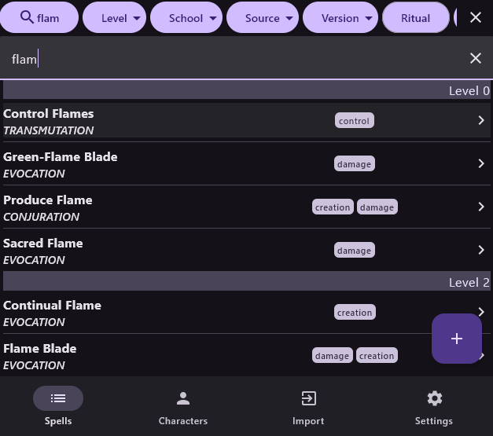
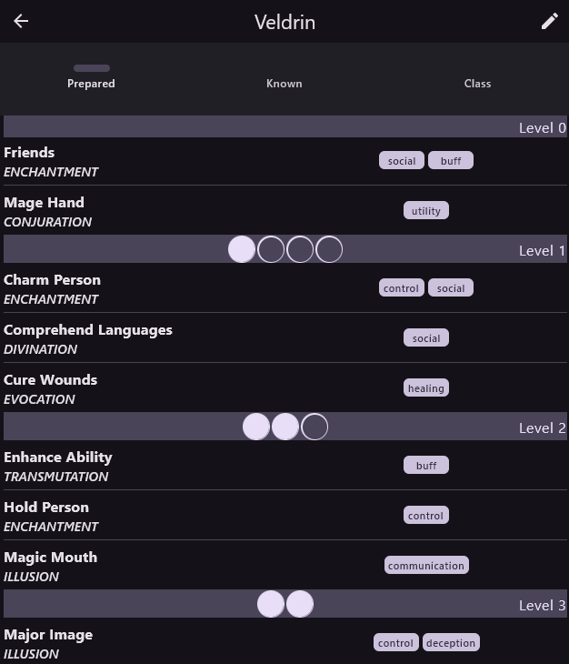
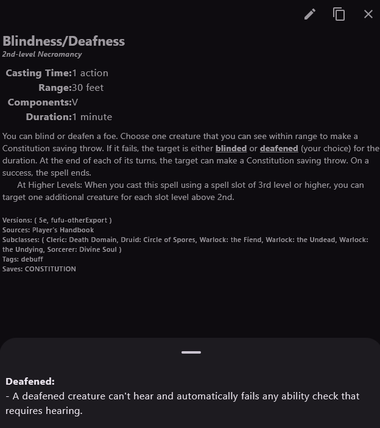
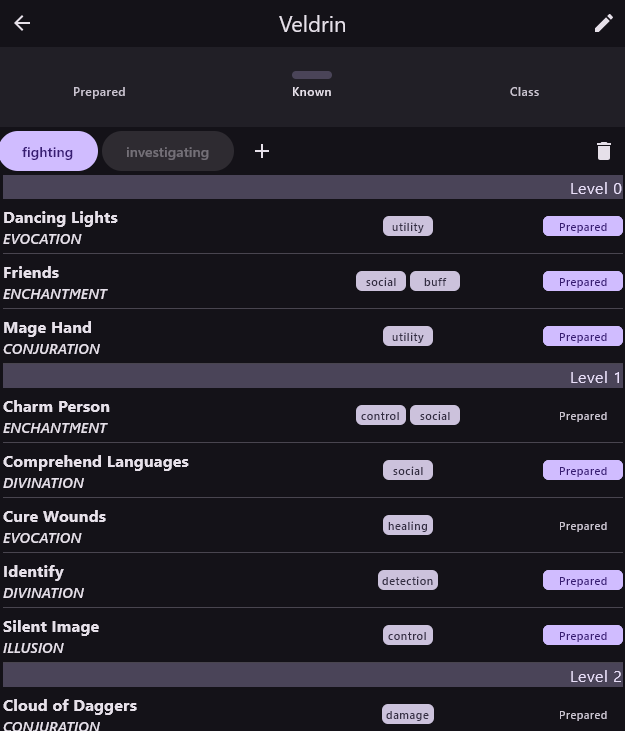
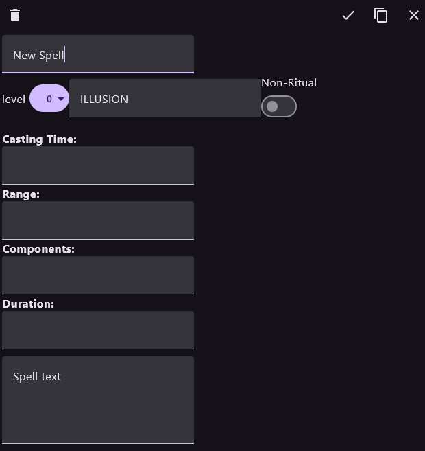
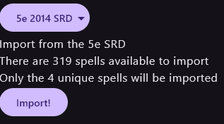
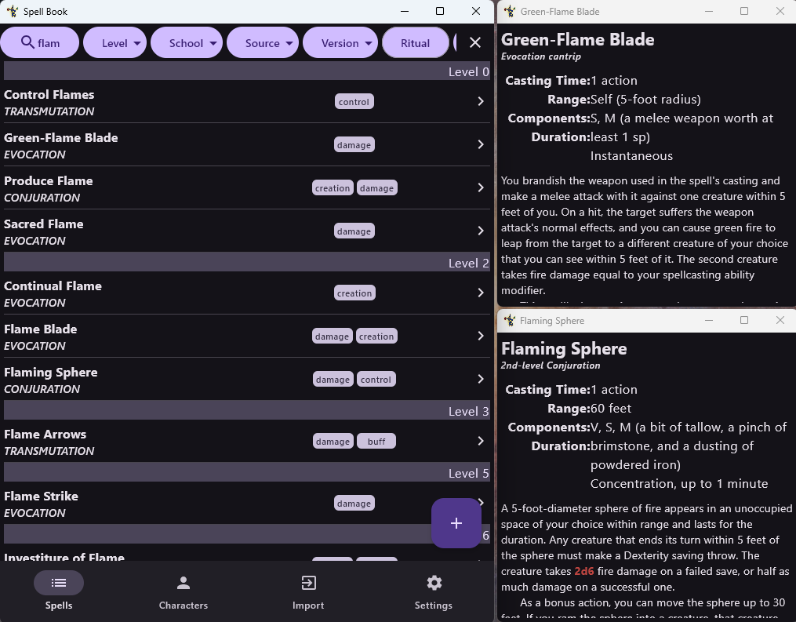

# TTRPG Spellbook app

## Platforms
Android and Desktop (Windows & Linux) thanks to Compose Multiplatform

## Other
I recommend this project be opened, edited, and run via android studio

## Version Bump Procedure
edit versionString and versionCode in src/build.gradle.kts

## Build
Build distribution:
`.\gradlew packageDistributionForCurrentOS`

## Features
- Filterable list of all spells for fast and easy lookup
    - 
- Per-character prepared, known, and class spell lists with spell slot tracking
    - 
- View conditions and their effects directly from within spell text
    - 
- Tracking of sets of prepared spells for quick spell preparation
    - 
- Duplicate and modify existing spells, or make completely new ones from scratch.
    - 
- Import spells from the 5e SRD api and JSON sources. More sources to come.
    - 
- Popout spell information on desktop
    - 