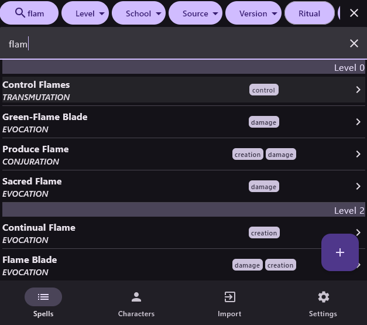
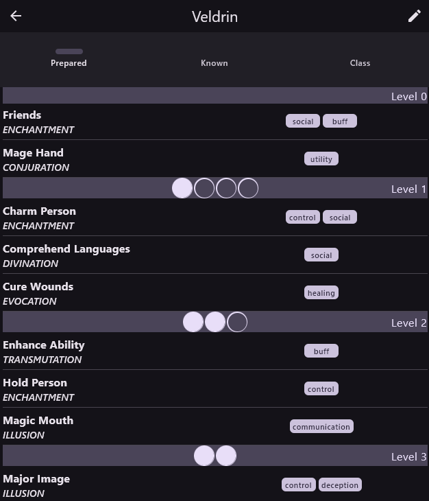
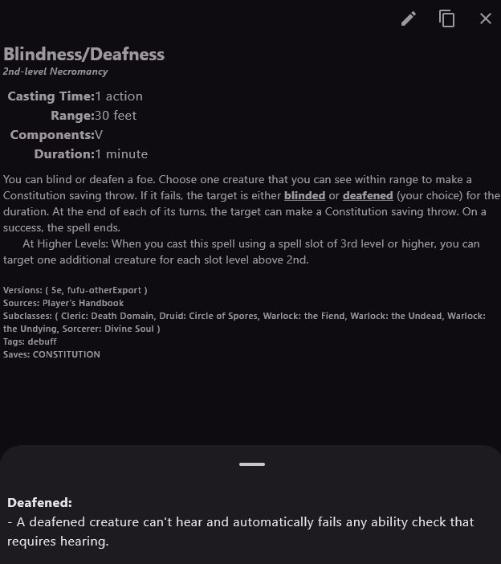
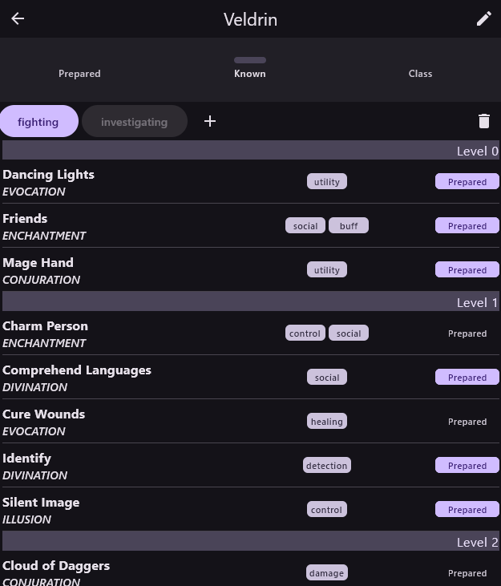
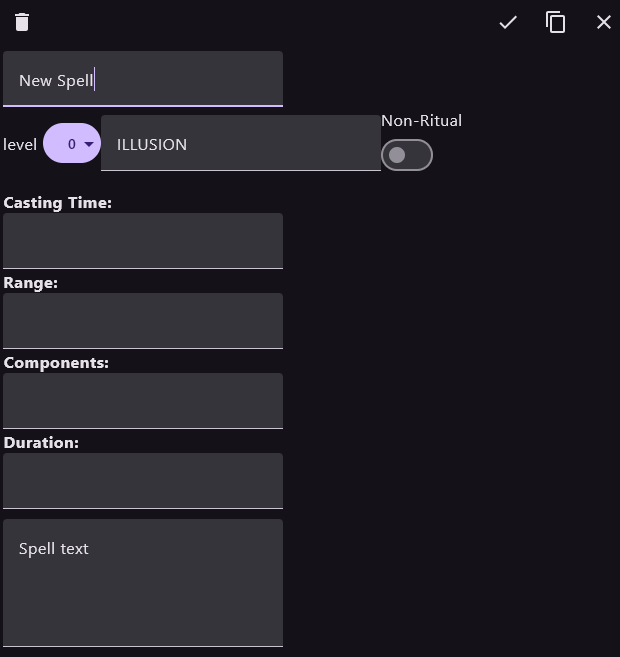
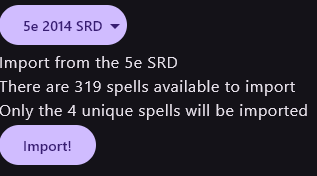
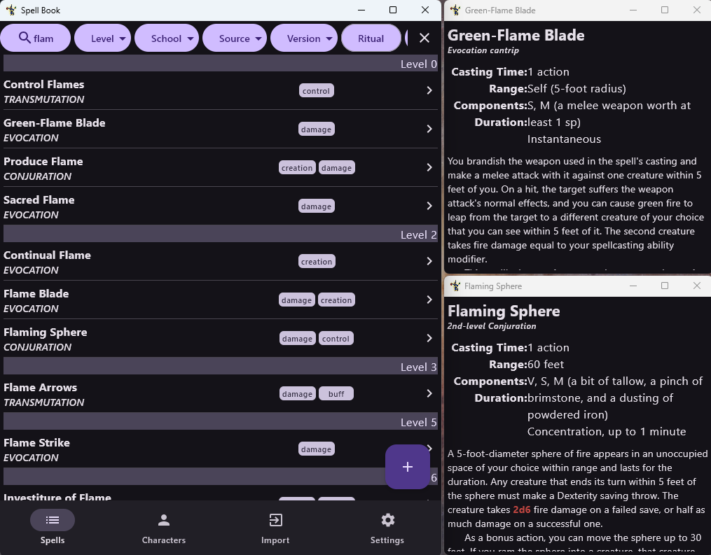

# TTRPG Spellbook app

Free, open-source spell tracking app for android and desktop. Track prepared spells and spellslots for different characters, make and use custom spells, search spells to prepare or learn, and instantly read annotated spell descriptions.

## Features
- Filterable list of all spells for fast and easy lookup
  - 
- Per-character prepared, known, and class spell lists with spell slot tracking
  - 
- View conditions and their effects directly from within spell text
  - 
- Tracking of sets of prepared spells for quick spell preparation
  - 
- Duplicate and modify existing spells, or make completely new ones from scratch.
  - 
- Import spells from the 5e SRD api and JSON sources. More sources to come.
  - 
- Popout spell information on desktop
  - 

## Installation
Installers and distributions are provided for various systems. Download the appropriate release for your system [here](https://github.com/ARoese/spellbook/releases/latest). Submit an issue if an installer doesn't work on your platform.

| Platform              | Installer |
|-----------------------|-----------|
| Windows               | .msi      |
| Android               | .apk      |
| Linux (Ubuntu >22.04) | .deb      |
| Linux (other)         | .tar.gz   |
| Other                 | .jar      |

I do not publish to the Google Play Store. In order to install on android, you need to install the APK manually. Download the APK on your phone, then tap the "download complete" notification to install it. Reference [this tutorial](https://www.lifewire.com/install-apk-on-android-4177185) for further assistance.

## Manual Build
1. Clone this repository
2. install java 21, and java 11
  - The java 11 dependency is for KsonMuli. Ideally, this will be upgraded or removed. However, the current release of that library doesn't work for us.
3. run the gradle wrapper
   - `.\gradlew packageDistributionForCurrentOS`
4. Locate the executable/build result. 
   - Reference `.github/workflows/release.yml` for common paths for various systems

## Other
I recommend this project be opened, edited, and run via android studio

## Version Bump Procedure
edit versionString and versionCode in src/build.gradle.kts